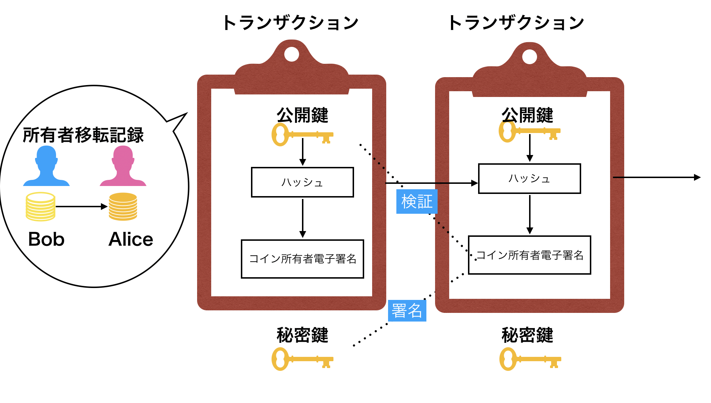

# Bitcoin: A Peer-to-Peer Electronic Cash System

#### トランザクション(取引)

* Bitcoinは電子署名の連結によって構成され、コイン所有者移転の全記録を追跡する事ができる
* トランザクションとは、コイン所有者移転を記録している取引情報である
* 秘密鍵を用いて、前トランザクションと公開鍵のハッシュに電子署名を行う
* 公開鍵を用いて、電子署名を行う

