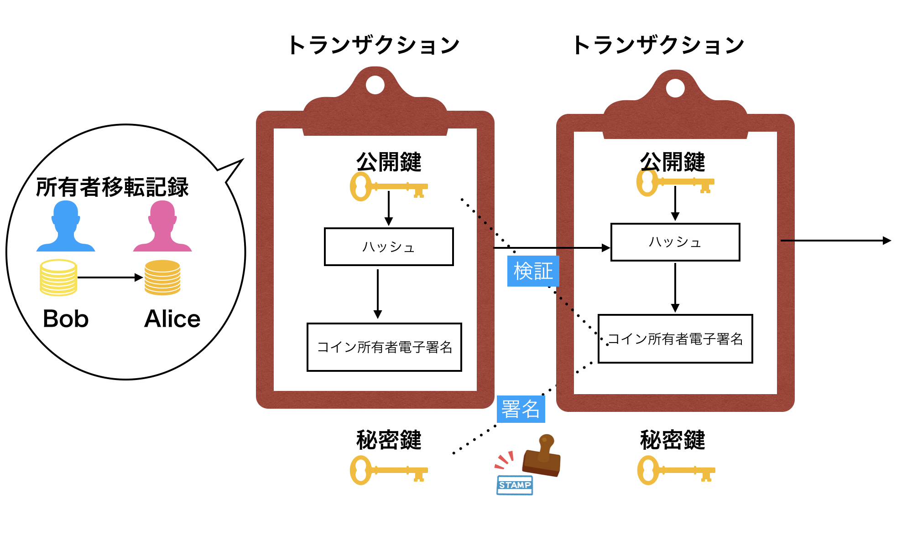
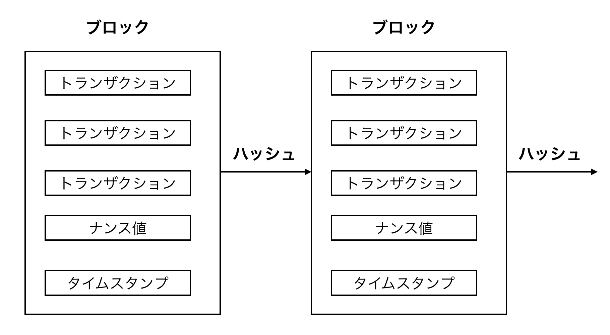

---

### 暗号資産Bitcoin
***

 
情報セキュリティ大学院大学 
情報セキュリティ研究科 
情報セキュリティ専攻 1年 
松本　彩花 

---
### 概要
***
* Bitcoinは第三者を介さずに取引を可能とした技術である
* 二重支払問題をP2Pを用いて解決している
* PoWにより、
  *  PoW: 1CPU1票の多数決によってブロックチェーンの意思決定をする仕組み

---

### トランザクション(取引)
***

* トランザクションとは、コイン所有者移転を記録している取引情報である
* Bitcoinは電子署名の連結によって構成されている
* 支払者はコイン所有者移転の全記録を追跡する事ができる
* 秘密鍵を用いて、前トランザクションと公開鍵のハッシュに電子署名を行う
* 公開鍵を用いて、電子署名を行う
* 複数の管理者が取引を複製管理するP2Pによって、二重支払を防止している

---
図1 Bitcoinの構造

---

### タイムスタンプサーバー
***

* タイムスタンプは、ハッシュが求められた時刻の証明をしている(ブロックが繋がれた時刻を証明している)
* トランザクションを含むブロックはハッシュによって連結されている
* ブロック更新前に、前のタイムスタンプに更新分が加えられ、強化される。

---
図2　タイムスタンプの仕組み

---

### PoW(Proof-of-Work)
***
* Work(CPU)によって、ブロックチェーンの意思決定をしている仕組み
  *  1CPU1票とし、仕事量の多数決による意思決定
* 計算量がもっとも膨大であり、もっとも長く繋がれたノードを採択する
  *  誠実なノードは最も早く繋がれる
* 一時間あたりのブロック生成量によって、ナンスの難しさが決められる

--- 

### Network
***
* ネットワークが動く仕組み 

1) すべてのノードに新しいトランザクションが広められる 
2) 互いのノードがブロックの中に新しいトランザクションを集める 
3) 互いのノードがブロックの中の異なるPoWを見つ 
4) ノードがPoWを見つけた場合、全てのノードにブロックを広める 
5) PoWが全てのトランザクションに 

---

### References
***
 [1] 2008 Satoshi Nakamoto, "Bitcoin: A Peer-to-Peer Electronic Cash System" [2] Roger Wattenhofer, "Blockchain Science: Distributed Ledger Technology"  
